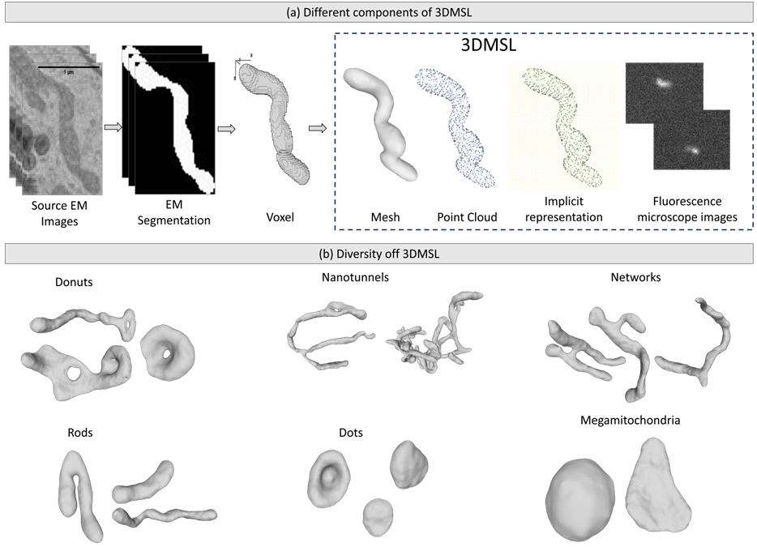
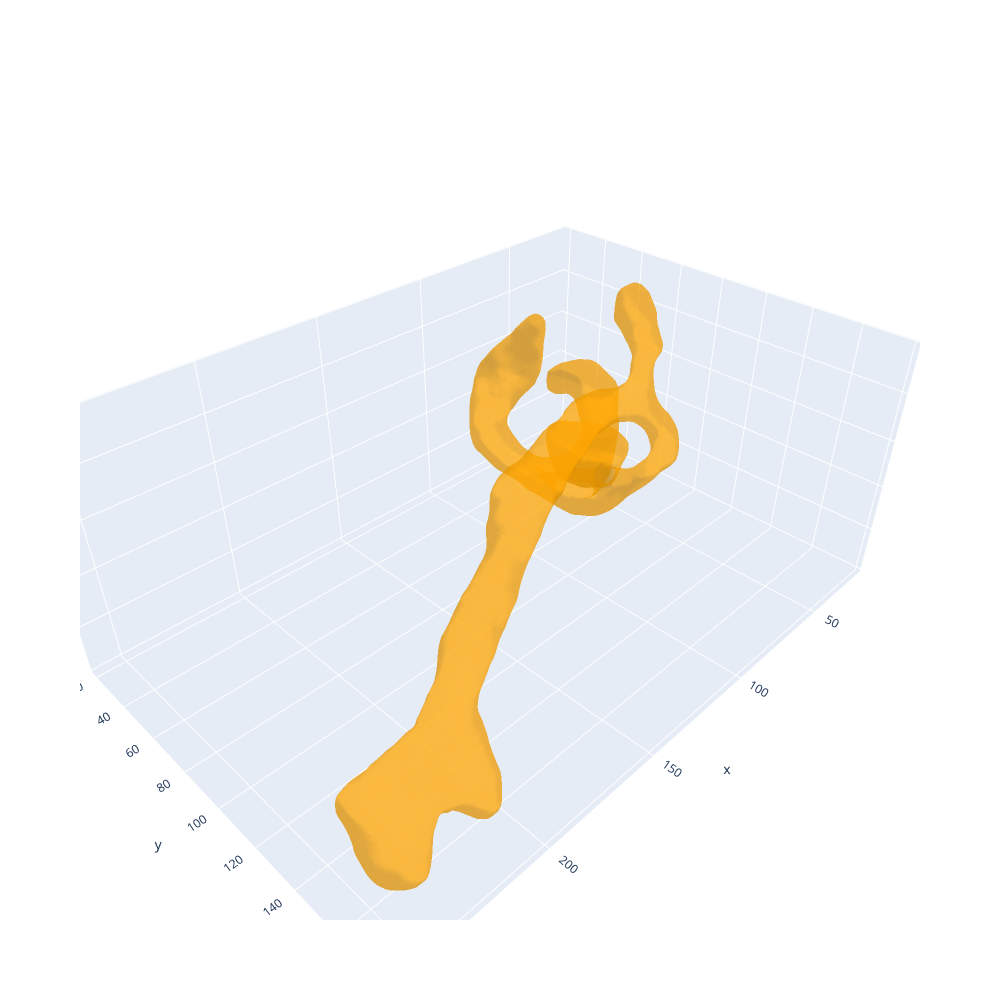
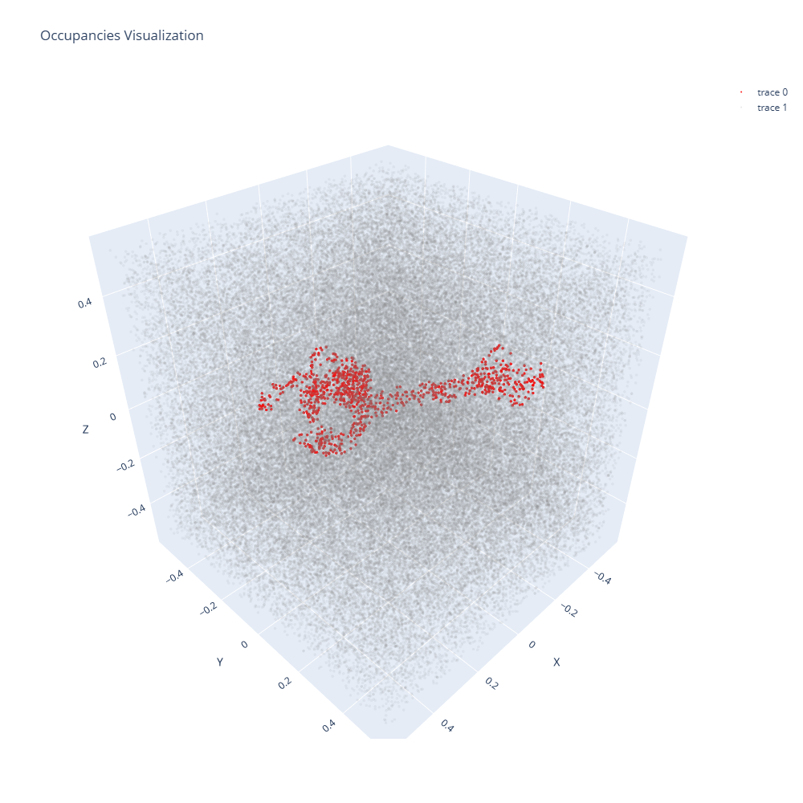
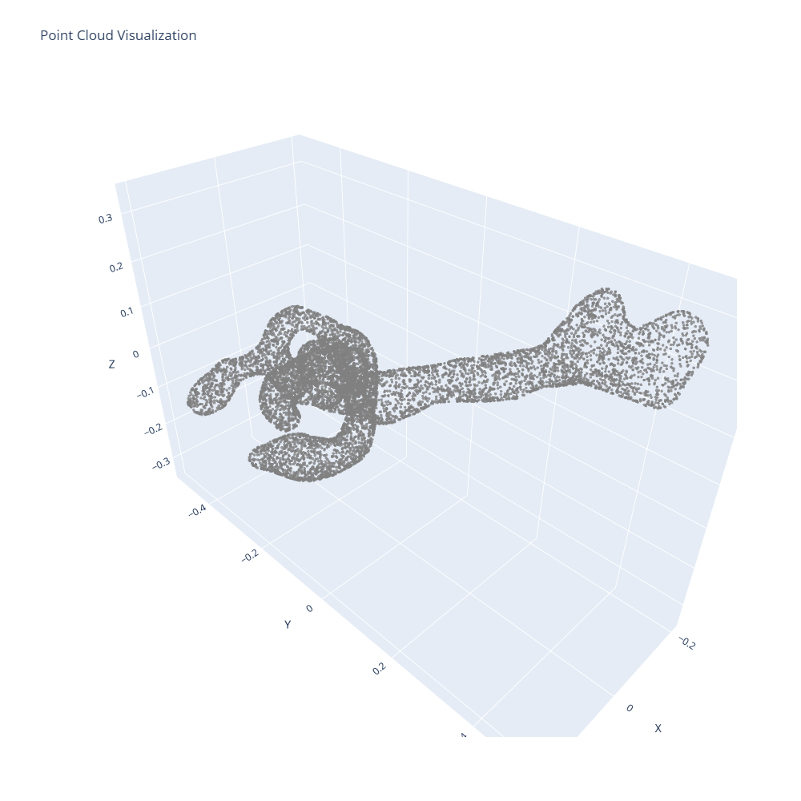
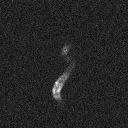
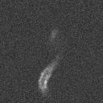
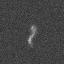

# 3DMSL Dataset Repository

This repository accompanies the 3DMSL dataset. 

Title of the paper : **3D Mitochondria Shape Library for Optical Microscopy (3DMSL): A multimodal dataset for deep learning based mitochondrial analysis**

Authors : Abhinanda R. Punnakkal, Suyog S. Jadhav, Aaron V. Celeste, Alexander Horsch, Krishna Agarwal, Dilip K. Prasad

Contact abhinanda.r.punnakkal@uit.no for any querries.

Keywords: Synthetic dataset; deep learning; 3D shape modelling; mitochondria analysis; 3D reconstruction

Abstract: 
With the increasing development of deep learning solutions for fluorescence microscopy image analysis, there is a growing demand for annotated ground truth datasets to train supervised methods. However, obtaining these annotations is a laborious and expensive endeavor.  To address this problem for microscope analysis of cell organelles, we release 3DMSL, a database of 3D shapes of mitochondria. 3DMSL utilizes high-resolution Electron Microscopy data as the source for creating the extensive database. Utilizing a physics-based simulator, 3DMSL enables the creation of large fluorescence microscope image datasets with 3D ground truths, which can be used to train deep learning models for various applications, including segmentation, 3D reconstruction from images and stacks, creation of time-lapse videos with 3D ground truth, and microscope-to-microscope translation. 3DMSL contains more than 27k instances of diverse mitochondria shapes in different 3D shape representation formats of meshes, point clouds and implicit shapes.




## Unpacking the dataset
3DMSL is published in DataverseNo(link[https://doi.org/10.18710/JX6JXF]). 
Download the dataset arracnged into 10 zip files into the 'data_zip' folder. The dataset is large (9GB per part), to access a subset of first 100 instances we recomend checking out the (link[https://figshare.com/s/7e4037d280ad61c5af05]).

To unpack the entire dataset after downloading, run the following command after making necessary adjustments to the paths:

```
python data_unpack.py --zip_path <path_to_zipped_files> --data_path <path_to_unzip_files>
```
This will unpack individual instances in the 'data' folder. This step will take a while to complete. If you would liek to get a sneak-peak of the data, we suggest you keep only 1 zip file of the 10 in the full dataset, in the 'data_zip' folder. 

### Data creation from EM segmentation
Follow the instructions in 'dataset_creation/dataset.md' to generate the different forms of instances available in 3DMSL. 

## Reading and Visualization
Use the jupyter notbook 'data_read_vis.ipynb' to read and vizualize the different data formats. 

The 3D visualizations are interactable. Below, we show snapshots of the mesh, occupancy and pointcloud formats of the instance 920.

<!--    -->
Mesh


Occupancy


Point cloud


The microscope images of the instance 920 in the different microscope configurations of Conf1 , Conf2, Epi1 (check associated paper for details of the configuration) are shown below. 

Conf1



Conf2 



Epi1



## Benchmarks
Follow the instructions in 'benchmarks/reconstruction.md' and 'benchmarks/segmentation.md' for setting up and evaluating different benchmarks used for 2d to 3D reconstruction and segmentation of microscope images of mitochondria using 3DMSL. 

## Citation
You can cite the dataset as : 
```
@data{JX6JXF_2024,
author = {Punnakkal, Abhinanda Ranjit and Jadhav, Suyog S and Celeste, Aaron Vaughn and Horsch, Alexander and Agarwal, Krishna and Prasad, Dilip K},
publisher = {DataverseNO},
title = {{3DMSL - 3D Mitochondria Shape Library for Optical Microscopy}},
year = {2024},
version = {V1},
doi = {10.18710/JX6JXF},
url = {https://doi.org/10.18710/JX6JXF}
}
```